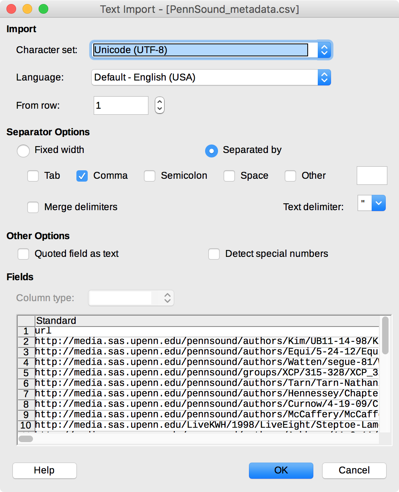
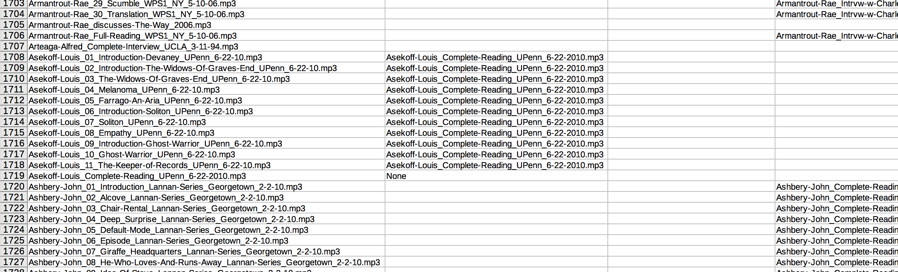

## PennSound Metadata Setup

- Install [LibreOffice](https://www.libreoffice.org/).

- Install [GitHub Desktop](https://desktop.github.com/) and create a GitHub account if you don't already have one.

- On the [GitHub page for this repo](https://github.com/stevemclaugh/pennsound-metadata), click `Clone or download,` then `Open in Desktop` to clone the repo to your local system.

- Open `PennSound_metadata.csv` in LibreOffice and make sure your CSV import settings match these:

- For convenience, select `View > Freeze Cells > Freeze First Row` to freeze the header row at the top of the window. Then select `Tools > Automatic Spell Checking` to turn off those wavy red underlines.

- Here's an example of correctly labeled `isPartOf` relationships. Note that the complete reading at the bottom is marked `None`, meaning it does not appear to be excerpted from any other file.

- Save your progress in LibreOffice. When you're finished, open **GitHub Desktop** and click `X Uncommitted Changes` at the top of the window. Enter a brief note in the `Summary` box, then click `Commit to master`. Finally, click `Sync` at the upper right to upload your changes to GitHub.
